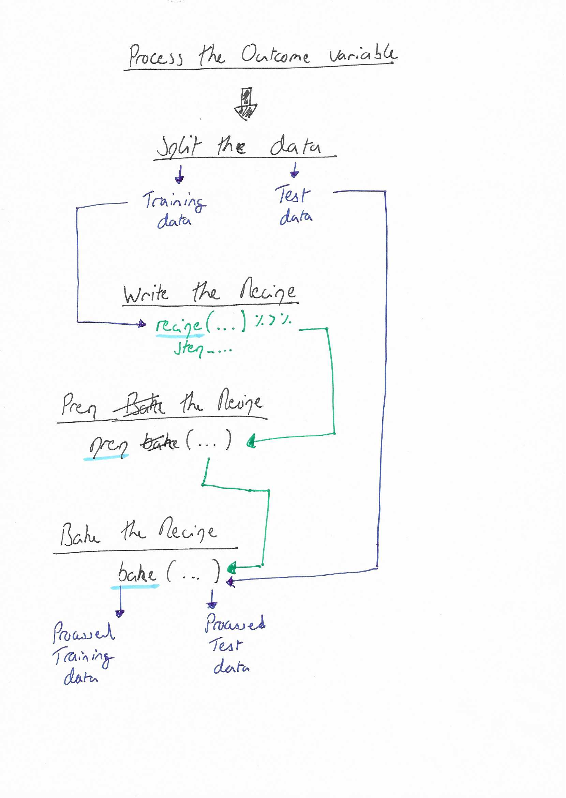

# Feature engineering with recipes

**Learning objectives:**

-   Define **feature engineering.**
-   List **reasons** that feature engineering might be **beneficial.**
-   Use the {recipes} package to **create a simple feature engineering recipe.**
-   Use selectors from the {recipes} package to **apply transformations to specific types of columns.**
-   List some **advantages of using a recipe** for feature engineering.
-   Describe **what happens when a recipe is prepared** with `recipes::prep()`.
-   Use `recipes::bake()` to **process a dataset.**
-   Recognize how to use `recipes::step_unknown()`, `recipes::step_novel()`, `recipes::step_other()` to **prepare factor variables.**
-   Explain how `recipes::step_dummy()` **encodes qualitative data in a numeric format.**
-   Recognize techniques for dealing with large numbers of categories, such as feature hashing or encoding using the {embed} package (as described in [this talk by Alan Feder at rstudio::global(2021)](https://rstudio.com/resources/rstudioglobal-2021/categorical-embeddings-new-ways-to-simplify-complex-data/)).
-   Recognize methods for **encoding ordered factors.**
-   Use `recipes::step_interact()` to add **interaction terms** to a recipe.
-   Understand why **some steps might only be applicable to training data.**
-   Recognize the **functions from `{recipes}` and `{themis}`** that are **only applied to training data** by default.
-   Recognize that `{recipes}` includes functions for **creating spline terms,** such as `step_ns()`.
-   Recognize that `{recipes}` includes functions for **feature extraction,** such as `step_pca()`.
-   Use `themis::step_downsample()` to **downsample** data.
-   Recognize other **row-sampling steps** from the `{recipes}` package.
-   Use `recipes::step_mutate()` and `recipes::step_mutate_at()` for general `{dplyr}`-like transformations.
-   Recall that the `{textrecipes}` package exists for **text-specific feature-engineering steps.**
-   Understand that the functions of the `{recipes}` package **use training data** for all preprocessing and feature engineering steps to prevent leakage.
-   Use `{recipes}` to **prepare data for traditional modeling functions.**
-   Use `tidy()` to **examine a recipe** and its steps.
-   Refer to columns with **roles** other than `"predictor"` or `"outcome"`.

## Cohort 3 Presentation

```{r, setup_recipes, include = FALSE}

knitr::opts_chunk$set(
 message = FALSE,
 cache = TRUE
)
```

```{r, library}
library(tidymodels)
library(tidyverse)
library(patchwork)
theme_set(theme_light())
```

```{r}
style_plot <- function(ylim = c(0,100)){
  list(
    # remove gap between x axis and base of bars
    coord_cartesian(ylim = ylim, expand = FALSE),
    
    # remove cluttering grid lines
    theme(panel.grid.major.x = element_blank(),
          panel.grid.minor.x = element_blank(),
          panel.grid.minor.y = element_blank()
    )
  )
}
```

### Introduction

-   

### How is feature engineering defined in TMWR?

-   "Feature engineering encompasses activities that reformat predictor values to make them easier for a model to use effectively. "

-   "This includes transformations and encodings of the data to best represent their important characteristics."

**Or more formally:**

-   "Adjusting and reworking the predictors to enable models to better uncover predictor-response relationships has been termed *feature engineering*." ([Kuhn and Johnson, 2019](http://www.feat.engineering/))

### Examples of feature engineering

"There are many ... examples of preprocessing to build better features for modeling:

-   [Creating a new variable which is the ratio of two predictor variables within a dataset];

-   Correlation between predictors can be reduced via feature extraction or the removal of some predictors;

-   When some predictors have missing values, they can be imputed using a sub-model;

-   Models that use variance-type measures may benefit from coercing the distribution of some skewed predictors to be symmetric by estimating a transformation."

### Where are we in the overall process of building a model?

Going back to the process of building a Machine Learning model (as shown in the slides for the last chapter).


### Understanding the culinary analogy

```{r}
# ames_rec <- 
#   recipe(Sale_Price ~ Neighborhood + Gr_Liv_Area + Year_Built + Bldg_Type + 
#            Latitude + Longitude, data = ames_train) %>%
#   
#   # a series of steps
#   step_log(Gr_Liv_Area, base = 10) %>% 
#   step_other(Neighborhood, threshold = 0.01) %>% 
#   step_dummy(all_nominal_predictors()) %>% 
#   step_interact( ~ Gr_Liv_Area:starts_with("Bldg_Type_") ) %>% 
#   step_ns(Latitude, Longitude, deg_free = 20)
```

Not a perfect analogy... but a helpful one.

+--------------------------------------------------+---------------------------------------------------------------------------------------------------------------------------+------------------+
| In the kitchen                                   | In Recipes                                                                                                                | Recipes function |
+==================================================+===========================================================================================================================+==================+
| Write a recipe.                                  | Write a recipe (i.e. a series of steps) which specify how the test and training data will be processed ahead of modeling. | `recipe()`       |
|                                                  |                                                                                                                           |                  |
|                                                  | -   e.g. center a variable `v`.                                                                                           |                  |
+--------------------------------------------------+---------------------------------------------------------------------------------------------------------------------------+------------------+
| Prepare the ingredients *(following the recipe)* | Based on the training set, estimate any parameters of the steps that will be needed to process data.                      | `prep()`         |
|                                                  |                                                                                                                           |                  |
|                                                  | -   e.g. calculate the mean of a variable (`mean(v)`)                                                                     |                  |
+--------------------------------------------------+---------------------------------------------------------------------------------------------------------------------------+------------------+
| Cook the food *(following the recipe)*           | Apply the recipe (i.e. each step in order) to process the training or test data.                                          | `bake()`         |
+--------------------------------------------------+---------------------------------------------------------------------------------------------------------------------------+------------------+

### The simplest illustrative example I could think of with the AMES data

-   **Outcome variable:** `Sale_Price`

-   **Two predictor variables:**

    -   `Gr_Liv_Area`

    -   `Year_Built`

#### Let's look at the data before deciding how to process it.

```{r}
# import the ames data
data(ames)
ames_data <- ames 


# create plot base
p <- ggplot(ames_data, aes(Sale_Price))

# create histogram (sales price untransformed)
p1 <- p +
  geom_histogram(colour = "grey50",
                   fill = "grey70", binwidth = 20000) +
  
  style_plot(ylim = c(0,550)) +
  
  scale_x_continuous(labels = dollar) +
  
  labs(x = "\nSales price",
       y = "\nNumber of properties")

# create frequency polygon plot (log transformed scale)
p2 <- p +
  
  geom_freqpoly(colour = "grey70", size = 1.5) +
  
  style_plot(ylim = c(0,550)) +
  
  scale_x_log10(labels = dollar) +
  labs(x = "\nSales price (log scale)",
       y = "")

# combine plots side by sise for comparability
p1 + p2 +
  plot_annotation(title = "Sale Price could be log transformed ahead of modelling\n")
```

```{r}
# create plot base
p <- ggplot(ames_data, aes(Gr_Liv_Area))

# create histogram (untransformed ground floor living area)
p1 <- p + 
    geom_histogram(colour = "grey50",
                   fill = "grey70", binwidth = 200) +
  
  style_plot(ylim = c(0,550)) +
  
  labs(x = "\nGround floor living area (square feet)",
       y = "\nNumber of properties\n")

# create frequency polygon (log transformed ground floor living area)
p2 <- p + 
  geom_freqpoly(colour = "grey70", size = 1.5) +
  
  style_plot(ylim = c(0,550)) +
  scale_x_log10() +
  
  labs(x = "\nGround floor living area (square feet)\n(log scale)",
       y = "")

# combine plots side by side for comparability
p1 + p2 +
  plot_annotation(title = "Also ground floor living area could be log transformed\n")
```

```{r}
# calculate mean year built for centering
mean_year_built <- round(mean(ames_data$Year_Built), 0)

p <- ggplot(ames_data, aes(Year_Built))

p +
  geom_vline(xintercept = mean_year_built, size = 3, 
             color = "grey70", alpha = 0.5) +
  geom_histogram(colour = "grey50",
                   fill = "grey70", binwidth = 5) +
  annotate("text", x = mean_year_built - 15, y = 400,
           label = glue::glue("The mean year\nbuilt is {mean_year_built}"),
           colour = "grey50", size = 4) +
  
  style_plot(ylim = c(0,600)) +
  
  labs(x = "\nYear in which the property was built",
       y = "\nNumber of properties",
       title = "Maybe the year built variable could be centred to make to make\nit easier to interpret model coefficients\n")
```

```{r}
p <- ggplot(ames_data, aes(x = Year_Built - mean_year_built))

p +
  geom_vline(xintercept = 0, size = 3,
             color = "grey70", alpha = 0.5) +
  geom_histogram(colour = "grey50",
                   fill = "grey70", binwidth = 5) +
  annotate("text", x = - 15, y = 400,
           label = glue::glue("The mean year\nbuilt is {mean_year_built}"),
           colour = "grey50", size = 4) +
  
  scale_x_continuous(breaks = seq(-100, 80, 20)) +
  
  style_plot(ylim = c(0,600)) +
  
  labs(x = "\nCentred year built (0 = 1971)",
       y = "\nNumber of properties\n",
       title = "Maybe the year built variable could be centred to make to make\nit easier to interpret model coefficients\n")
```

#### Processing the data

First, just select the subset of variables we are interested in.

```{r}
# focus down on our current variables of interest
ames_data_focus <- ames_data %>%
  select(Sale_Price, Gr_Liv_Area, Year_Built)

```

**Transforming the outcome variable before we start using `Recipes`**

```{r}
# log transform the outcome variable
ames_data_focus <- ames_data_focus %>%  
  mutate(Sale_Price = log10(Sale_Price)) 
```

Why not transform the outcome variable in the recipe itself:

``` {.r}
 step_log(Sale_Price, base = 10)
```

"This will cause a failure when the recipe is applied to new properties when the sale price is not known. Since price is what we are trying to predict, there probably won't be a column in the [test] data for this variable.

For simple transformations of the **outcome** column(s), we strongly suggest that those operations be *conducted outside of the recipe*."

**Splitting the data**

```{r}
# split the data into training and test sets
set.seed(123)
ames_split <- initial_split(ames_data_focus, prop = 0.80, strata = Sale_Price)
ames_train <- training(ames_split)
ames_test  <-  testing(ames_split)
```

#### Writing a simple recipe

```{r}
# write a simple recipe
ames_rec <- 
  
  recipe(Sale_Price ~ Gr_Liv_Area + Year_Built, data = ames_train) %>%
  
  step_log(Gr_Liv_Area, base = 10) %>%    # I think of these as add_step ...
  step_center(Year_Built)

ames_rec
  
```

What is being passed through the pipe? What does a recipe object look like?

```{r}
str(ames_rec)
```

#### Prep the recipe

This includes calculating a mean Year_Built from the training data.

```{r}
# prep the recipe
ames_rec <- prep(ames_rec)
ames_rec
```

Let's confirm what we expected with the centering has happen ...

```{r}
# check the mean year built for the different versions of the dataset
tribble(
  ~dataset, ~mean_year_built,
  "complete", mean(ames_data_focus$Year_Built),
  "training", mean(ames_train$Year_Built),
  "test", mean(ames_test$Year_Built)
)

# check the mean year built used by the recipe to center the variable
year_built_rec <- tidy(ames_rec, number = 2)
year_built_rec
```

#### Bake the recipe (twice)

-   **First bake:** using the training data.

-   **Second bake:** using the test data.

```{r}
# process the training data
ames_train_processed <- bake(ames_rec, new_data = NULL)
ames_train_processed

# process the test data
ames_test_processed <- bake(ames_rec, new_data = ames_test)
ames_test_processed
```

Confirm the value of the mean used to center `Year_Built` in the test dataset.

```{r}
ames_test_processed %>% 
  mutate(Year_Built_org = Year_Built + year_built_rec[[1,2]])
```

### An overview of the feature engineering process with recipes



### Functionality showcased in the chapter

### Resources

## Meeting Videos

### Cohort 1

`r knitr::include_url("https://www.youtube.com/embed/KmLKhIBrQPk")`

<details>

<summary>

Meeting chat log

</summary>

    00:06:28    Tyler Grant Smith:  getting kind of scruffy jon
    00:07:22    Jim Gruman: {purr}
    00:07:37    Jim Gruman: {purrr}
    00:18:31    Tony ElHabr:    is this thing on?
    00:18:39    Jonathan Trattner:  The chat?
    00:18:43    Jon Harmon (jonthegeek):    I know, it's so quiet over here!
    00:19:05    Tony ElHabr:    quiet chat is making me nervous
    00:19:27    Jonathan Trattner:  I’ll make some noise
    00:19:38    Jonathan Trattner:  🔈
    00:20:06    Tyler Grant Smith:  it would be good (in the bookdown) to have a comparison of stratified vs non-stratified sampling for this example.  with a comparison of the distributions
    00:20:07    Tony ElHabr:    ugh I read chapter 7
    00:21:38    Asmae Toumi:    Wait what does all_nominal do, missed it
    00:21:51    Jon Harmon (jonthegeek):    Selects all columns that... what she's saying :D
    00:21:54    Asmae Toumi:    Oh ok nvmd
    00:22:30    yonis:  We basically we to make to create a design matrix for the regression
    00:22:40    Joe Sydlowski:  For clarity to Jon's answer it won't include numeric vars, right?
    00:22:52    Tony ElHabr:    right
    00:23:06    Jon Harmon (jonthegeek):    all_numeric() is its counterpart
    00:23:59    Conor Tompkins: step_dummy() drops the reference level, I think
    00:24:46    yonis:  That is tricky. the reference level isn’t lined up with how base r is defined so you need to be careful with that
    00:25:47    yonis:  I ran a logistic regression and got into all kinds of trouble with how recipe was defining the ref level
    00:27:11    arjun paudel:   does it not set the reference level based on order of factor levels? that was my understanding
    00:27:29    arjun paudel:   if you want a specific level as you reference, you reorder your factor
    00:27:49    Conor Tompkins: That is my understanding as well Arjun
    00:29:17    Conor Tompkins: I use step_relevel to set the reference level
    00:30:15    yonis:  https://recipes.tidymodels.org/reference/step_relevel.html
    00:30:20    Tyler Grant Smith:  why are the counts almost monotonic, but not monotonic?
    00:31:42    Conor Tompkins: This is a great table to show this
    00:35:44    Scott Nestler:  I don't follow the mention of one-hot encoding in the book. Why would you use that instead of binary encoding like was just shown here.
    00:36:37    Asmae Toumi:    I say Tilda, is that right?
    00:38:01    Tony ElHabr:    one-hot: like removing the intercept term in your regression with a univariate categorical variable. so you get coefficients for each term
    00:38:16    Conor Tompkins: The winner of the big data bowl determines the pronunciation, I think
    00:38:27    Asmae Toumi:    Lmaooooooo
    00:38:32    Tan Ho: asmae v tony, fightttt
    00:38:53    Joe Sydlowski:  The benefit of one hot encoding is that you don't need to know (or explain) what the reference variable is when interpreting the coefficients. Not ever model can use one hot encoding though
    00:39:04    Scott Nestler:  @ Tony: But wouldn't that create the linear dependency problem as is discussed in the text?
    00:39:35    Scott Nestler:  Thanks, Joe.  Got it.  That makes sense.
    00:40:26    Tony ElHabr:    i think you're right about that Scott. or maybe my analogy was just bad
    00:41:06    Conor Tompkins: Are there best practices for determining the appropriate reference level? I typically use the most common level
    00:42:39    Scott Nestler:  ICA is my favorite type of feature extraction to use.  Makes use of higher-level moments than PCA, resulting in components that are truly statistically independent, not just uncorrelated.
    00:43:04    arjun paudel:   @Conor, what level you want as reference is entirely based on context of the problem, I don't think one standard way of determining the reference level would make sense
    00:43:37    Asmae Toumi:    conor I pick mine in a way that makes interpretation easier for ppl who digest the findings
    00:44:05    Scott Nestler:  Agree with Arjun and Asmae; it depends on the variable and ease of interpretation.
    00:44:16    Tony ElHabr:    any kind of thought put into reference level is probably better than alphabetical imo
    00:44:55    Tony ElHabr:    Scott, do you have a good reference on ICA?
    00:45:57    Jordan Krogmann:    Has anyone had to create the "bake" function in sql?  Let me tell you it's less than fun for new records hitting your model...
    00:46:12    Scott Nestler:  Book by Hyvarinen, Karhunen, Oja is one standard.  Book by Stone is more approachable.  I have a presentation on it that I developed too.  Happy to share.
    00:46:25    Daniel Chen:    how is the recipie object implemented? is it a dataframe with an attribute table that defines whether or not a variable is a predictor or response?
    00:47:22    Jon Harmon (jonthegeek):    There's a tibble in there, but it has a lot going on. I... can't remember details, it's been a bit since I dug into it.
    00:48:47    Daniel Chen:    s3 objects are just lists with an attr defined, right?
    00:50:16    Jon Harmon (jonthegeek):    They're not necessarily lists.
    00:50:33    Tony ElHabr:    attributes are the magic to S3
    00:50:48    Tony ElHabr:    but right, not necessarily lists
    00:50:49    Tan Ho: deep, dark magic
    00:50:52    Jon Harmon (jonthegeek):    If I remember right, recipes are lots o' attributes.
    00:50:56    Tyler Grant Smith:  sounds like someone wants to write dbrecipes
    00:51:04    Tony ElHabr:    sounds like ETL
    00:51:15    Asmae Toumi:    dbrecipes omg
    00:51:46    Conor Tompkins: Luv 2 engineer data
    00:51:53    Tan Ho: "do all the work for you" eh
    00:52:35    arjun paudel:   hahaa
    00:52:56    arjun paudel:   i meant you don't have to prep or bake it yourself
    00:53:13    Jordan Krogmann:    lol, I guess I was looking for a reason to lose sleep @tyler
    00:53:28    Tony ElHabr:    step_drop_table in dbrecipes could be disastrous
    00:54:46    Conor Tompkins: step_rm_rf
    00:54:49    Tony ElHabr:    tidymodels before workflows was an experience
    00:55:14    Tan Ho: it's superseded by bake NULL
    00:55:49    Tony ElHabr:    every time i typed juice() i felt disgusting
    00:56:00    Asmae Toumi:    lmfao
    00:56:29    Conor Tompkins: Workflow feels like the %>% for tidymodels
    00:58:17    Asmae Toumi:    hahahahahahah
    00:58:36    Tyler Grant Smith:  no congrats for tan
    00:58:39    Tony ElHabr:    thanks y'all
    00:59:03    Jordan Krogmann:    Thanks pavitra!
    00:59:06    Jordan Krogmann:    great job
    00:59:10    Daniel Chen:    my prelims are next week xDDD
    00:59:14    Asmae Toumi:    I made parsnip puree this weekend it was sooooooooooo good, so much better than mashed potatoes
    00:59:24    Tony ElHabr:    tony, tan, tyler, t-rex
    00:59:26    Tony ElHabr:    all the same
    00:59:47    Asmae Toumi:    Jordan should go since he’s gonna be busy soon writing dbrecipes
    01:00:48    Asmae Toumi:    YESSSSSSSSSSSSSSSSS
    01:00:54    Asmae Toumi:    My impact!!!!!
    01:01:15    Jordan Krogmann:    lol thanks a lot Asmae!
    01:01:45    Tony ElHabr:    thanks so much Pavitra!
    01:01:50    Tony ElHabr:    great presentation
    01:01:54    Jonathan Trattner:  Great job Pavitra!
    01:02:00    Conor Tompkins: Thanks Pavitra!
    01:02:00    Andrew G. Farina:   Thank you Pavitra, that was a busy chapter!
    01:02:09    Jonathan Trattner:  I’ll deff be asking about prep and bake again (:
    01:03:11    Scott Nestler:  I'm surprised that "mise en place" didn't make an appearance in this chapter.
    01:03:12    Jonathan Trattner:  I’ll play with it a little bit but thanks!
    01:04:48    Daniel Chen:    it'll be less weird when we get to workflow
    01:05:09    Jonathan Trattner:  Thank you!
    01:06:40    Jordan Krogmann:    Thanks gonna drop guys, it's been great!

</details>
